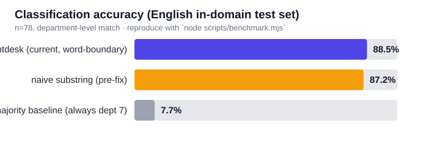
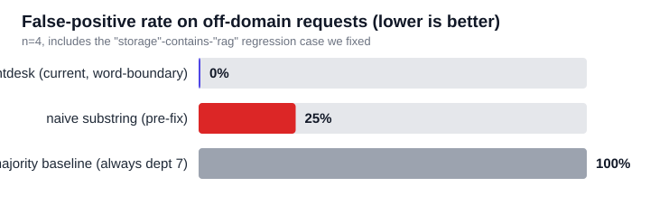
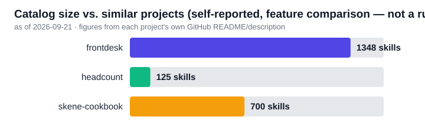

# frontdesk

<sub><a href="README.md">한국어</a> &middot; <a href="README.zh.md">中文</a></sub>

A front desk for AI dev requests: instead of paging a heavy general-purpose agent for every task, it first decides which of 13 departments (from strategy/ideation to engineering, design, and marketing) the request belongs to. This is step one toward a unified AI tool that handles everything a software company does — from validating an idea to revenue model, marketing, design, and engineering. It's a catalog of AI developer agents/skills collected from GitHub and [skills.sh](https://skills.sh), classified as finely as a real company's org chart.

## This project is itself an installable Skill

`skills/frontdesk/` is a self-contained skill package following the [Agent Skills spec](https://skills.sh) — install it the same way you'd install [ponytail](https://github.com/DietrichGebert/ponytail):

```bash
npx skills add TLSRUF/frontdesk@frontdesk
```

Once installed, Claude will check "is there already a skill for this?" before doing a task from scratch. Skill usage instructions live in [`skills/frontdesk/SKILL.md`](skills/frontdesk/SKILL.md); a human-readable intro is in [`skills/frontdesk/README.md`](skills/frontdesk/README.md).

## What's here

- **[skills/frontdesk/CATALOG.md](skills/frontdesk/CATALOG.md)** — 1,311 agents/skills classified into 13 departments / ~57 sub-categories (the human-readable end product)
- **[ARCHITECTURE.md](ARCHITECTURE.md)** — the design direction for a unified orchestrator built on this catalog, and the rule-based router prototype (applying [ponytail](https://github.com/DietrichGebert/ponytail)'s low-token decision ladder to "agent selection" instead of "writing code")
- **[skills/frontdesk/taxonomy.mjs](skills/frontdesk/taxonomy.mjs)** — the classification scheme (departments/sub-categories/keyword hints)
- **`skills/frontdesk/data/catalog.json`** — the final classified data (machine-readable source of truth)
- **`skills/frontdesk/data/unclassified.json`** — items that failed auto-classification (for manual review, 23 entries)
- **`skills/frontdesk/scripts/route.mjs`** — the decision-ladder router prototype (`npm run route -- "task description"`)

## Starter pack & pipeline

- **Starter pack** — for "just install this one thing and get the best skill per department automatically." `npm run starter-pack` picks the most-installed, confidently-classified item per department (12 currently), and `node scripts/install-starter-pack.mjs --yes` installs all of them at once. **Note: this picks the most-*installed* skill, not the best-*performing* one** — there's no performance measurement to rank by yet, so popularity is used as a proxy.
- **Pipeline** — 8 stages (idea → product definition → design → engineering → QA/security → marketing/sales → deploy → ops) that reuse the existing catalog/router, scoped per stage to the relevant department(s): `node scripts/pipeline.mjs "project description"`. Deploy and ops can affect a real service, so this is designed for **human confirmation at every stage transition** (not a fully unattended run end-to-end).

Full design rationale and limitations are in [`ARCHITECTURE.md`](ARCHITECTURE.md) under "스타터팩" / "파이프라인" / "목표 대비 현황" (Korean headings, but readable via the code blocks and tables).

## Performance / Benchmark




We measured the router's classification accuracy against a hand-written 87-task test set (reproduce with `node scripts/benchmark.mjs`):

| | Accuracy (78 English cases) | False-positive rate (4 off-domain cases) |
|---|---:|---:|
| **frontdesk (current)** | **88.5%** | **0%** |
| naive substring (what this project originally used) | 87.2% | 25% |
| majority baseline | 7.7% | 100% |

The interesting number isn't the accuracy gap (88.5% vs. 87.2%) — it's the **false-positive rate (0% vs. 25%)**. The naive approach misclassified completely unrelated requests as `7.3 RAG/vector search` just because the word "storage" contains the substring "rag" — a real bug we found and fixed during this project. Average classification time: 0.05ms per call, no LLM call, zero token cost.

A scale comparison against similar catalog-style projects (self-reported figures, not a runtime benchmark):



Full methodology, the bugs we found, and known limitations are in [`skills/frontdesk/BENCHMARK.md`](skills/frontdesk/BENCHMARK.md) (Korean; the charts and numbers are legible either way).

## Rebuilding the catalog

From inside `skills/frontdesk/`:

```bash
npm run all   # collect:github → collect:skillssh → classify → enrich → build:catalog → starter-pack
```

Individual steps:

```bash
npm run collect:github    # collect GitHub repos via gh CLI (data/raw/github/)
npm run collect:skillssh  # collect skills.sh skills via `npx skills search` (data/raw/skillssh/)
npm run classify          # auto-classify with taxonomy.mjs keywords -> data/catalog.json (regenerated from raw every time)
npm run enrich            # backfill real descriptions for popular skills.sh entries from their SKILL.md
npm run build:catalog     # generate CATALOG.md
npm run starter-pack      # pick the top skill per department -> data/starter-pack.json
npm run install-starter-pack -- --yes   # actually install the starter pack
npm run pipeline -- "project description"   # print the 8-stage pipeline roadmap
npm run route -- "recommend a testing automation tool"   # router demo
npm run benchmark         # run the accuracy/false-positive benchmark and regenerate charts
```

`classify` always rebuilds the catalog wholesale from raw data, so it must run before `enrich` (reversing the order wipes the backfilled descriptions). `npm run all` already guarantees this order.

Requires `gh` CLI logged in (`gh auth status`) and Node.js 18+.

## Collection scope

- **GitHub**: 27 seed topics (`agent-skills`, `ai-agents`, `mcp-server`, `rag`, `terraform`, `product-management`, `sales-automation`, etc.), stars > 30
- **skills.sh**: 36 keywords (representative per department)

This is a representative sample across 13 departments, not an exhaustive crawl. Add seeds to `skills/frontdesk/scripts/collect-*.mjs` to expand it.

## Why everything lives inside the skill folder

`npx skills add` and Claude Code plugin installs only copy the **`skills/<name>/` folder itself** (verified directly against the vercel-labs/agent-skills and anthropics/skills repos). So everything the router depends on — `taxonomy.mjs`, `data/catalog.json`, `scripts/*.mjs` — has to live inside that folder for the skill to work standalone once someone installs it, without needing the rest of this repo. The repo root only keeps human-facing design docs (`README.md`, `ARCHITECTURE.md`, `LICENSE`).

## Why gh CLI / skills CLI instead of Playwright

The original plan was to crawl GitHub and skills.sh directly with Playwright. After investigating:
- GitHub: the `gh` CLI (REST search API) is already authenticated and returns structured JSON immediately.
- skills.sh: its public REST API requires authentication, but its official CLI (`npx skills search`) returns the same data without it.

Both are lighter and more reliable than browser rendering for getting the same data, so that's what we used. (See ARCHITECTURE.md for details.)
