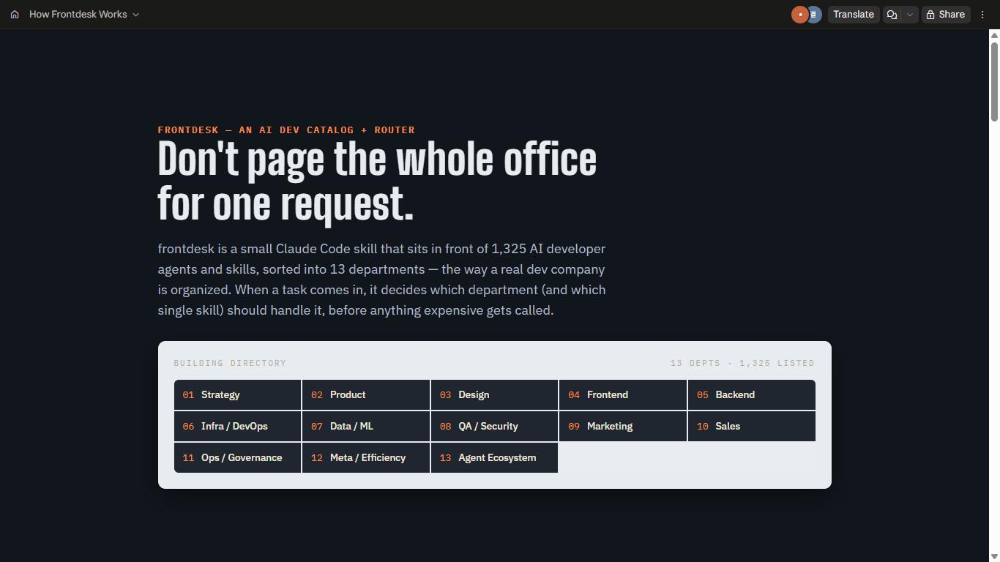
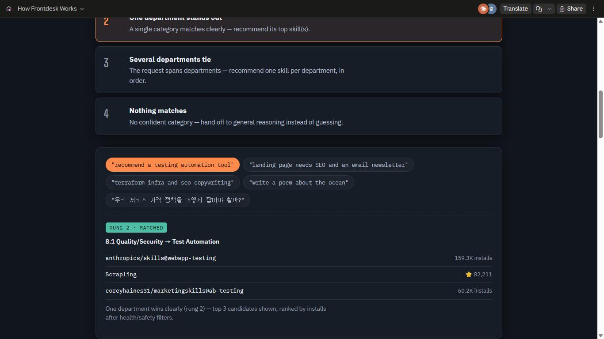

# frontdesk

<sub><a href="README.en.md">English</a> &middot; <a href="README.zh.md">中文</a></sub>

요청이 들어오면 무거운 범용 에이전트부터 부르지 않고, 13개 부서(전략/기획부터 개발·디자인·마케팅까지) 중 어디로 보낼지 먼저 판단하는 프런트데스크. 아이디어 검증부터 수익모델, 마케팅, 디자인, 개발까지 소프트웨어 회사의 모든 기능을 한 번에 처리하는 통합 AI 툴을 만들기 위한 1단계로, GitHub과 [skills.sh](https://skills.sh)에서 AI 개발자용 에이전트/스킬을 수집해 실제 개발 회사 조직도처럼 세분화된 분야별로 분류한 카탈로그다.

<p align="center">
  
  
</p>
<p align="center"><sub>👉 <a href="https://claude.ai/artifact/R3E1tXFd7eoDEwQZdk6bYC">인터랙티브 버전 열어보기</a> — 실제 요청 예시를 눌러보면 진짜 라우팅 결과가 뜬다.</sub></p>

## 이 프로젝트는 스킬로도 설치할 수 있다

`skills/frontdesk/`는 [Agent Skills 스펙](https://skills.sh)을 따르는 자기완결적 스킬 패키지다 — [ponytail](https://github.com/DietrichGebert/ponytail)을 설치해서 쓰듯이, 다른 사람도 이걸 자기 프로젝트에 설치해서 쓸 수 있다:

```bash
npx skills add TLSRUF/frontdesk@frontdesk
```

설치하면 Claude가 어떤 작업을 받았을 때 "이미 존재하는 스킬로 되는 일인가?"를 먼저 확인하게 된다. 스킬 자체의 사용법은 [`skills/frontdesk/SKILL.md`](skills/frontdesk/SKILL.md), 사람이 읽는 소개는 [`skills/frontdesk/README.md`](skills/frontdesk/README.md)에 있다.

## 결과물

- **[skills/frontdesk/CATALOG.md](skills/frontdesk/CATALOG.md)** — 13개 부서 / ~57개 세부분야로 분류된 1,348건의 에이전트/스킬 목록 (사람이 읽는 최종 산출물)
- **[ARCHITECTURE.md](ARCHITECTURE.md)** — 이 카탈로그를 기반으로 통합 오케스트레이터를 어떻게 만들지에 대한 설계 방향, 그리고 규칙 기반 라우터 프로토타입 설명 ([ponytail](https://github.com/DietrichGebert/ponytail)의 저토큰 판단 사다리를 "에이전트 선택"에 적용)
- **[skills/frontdesk/taxonomy.mjs](skills/frontdesk/taxonomy.mjs)** — 분류 체계 정의 (부서/세부분야/키워드 힌트)
- **`skills/frontdesk/data/catalog.json`** — 분류된 최종 데이터 (기계가 읽는 원본)
- **`skills/frontdesk/data/unclassified.json`** — 자동 분류 실패 항목 (수동 검토용, 9건)
- **`skills/frontdesk/data/manual-overrides.json`** — 키워드 매칭이 놓친 항목을 사람이 직접 분류한 예외 목록 (14건, 자동 매칭보다 우선 적용)
- **`skills/frontdesk/scripts/route.mjs`** — 판단 사다리 라우터 (`npm run route -- "작업 설명"`, `--install` 붙이면 승인 후 그 자리에서 바로 설치까지)

## 스타터팩 & 파이프라인

- **스타터팩** — "이거 하나만 설치하면 부서별로 제일 나은 스킬이 다 갖춰지길 원한다"는 목표에 대한 답. `npm run starter-pack`으로 13개 부서 중 신뢰도 높게 분류되고, 방치되지 않았고(`health_score`) 보안 위험 신호도 없는(`audit_score`, Socket/Snyk 등 공개 감사 API) 항목의 설치 수 1위를 뽑고(13개 부서 전부), `node scripts/install-starter-pack.mjs --yes`로 한 번에 설치한다. **주의: 이건 "가장 성능이 뛰어난" 스킬이 아니라 "안전하고 방치되지 않은 것 중 가장 많이 설치된" 스킬이다** — 실제 성능을 측정할 방법이 아직 없다 (Reddit 언급 수도 검토했지만 ponytail조차 검색으로 신호가 안 잡혀서 포기했다).
- **파이프라인** — 아이디어 → 프로덕트 정의 → 디자인 → 개발 → 품질/보안 → 마케팅/세일즈 → 배포 → 운영, 8단계로 기존 카탈로그/라우터를 재사용해 단계별 추천을 준다: `node scripts/pipeline.mjs "프로젝트 설명"`. 배포·운영 단계는 실제 서비스에 영향을 줄 수 있어 **단계마다 사람이 확인하고 넘어가는 걸 전제**로 설계했다 (전 구간 자동 실행 아님).

자세한 설계 배경과 한계는 [`ARCHITECTURE.md`](ARCHITECTURE.md)의 "스타터팩"·"파이프라인"·"목표 대비 현황" 절 참고.

## 성능/벤치마크


라우터의 분류 정확도를 직접 작성한 87개 테스트 문장으로 실측했다 (재현: `node scripts/benchmark.mjs`):

| | 정확도 (영어 78건) | 오탐률 (off-domain 4건) |
|---|---:|---:|
| **frontdesk (현재)** | **88.5%** | **0%** |
| naive substring (이 프로젝트가 원래 쓰던 방식) | 87.2% | 25% |
| 다수결 베이스라인 | 7.7% | 100% |

핵심은 정확도 차이(88.5% vs 87.2%)가 아니라 **오탐률(0% vs 25%)**이다 — naive 방식은 "storage"라는 단어에 "rag"가 부분 문자열로 들어있다는 이유만으로 완전히 무관한 요청을 잘못 분류했다(실제로 발견해서 고친 버그). 1회 분류에 평균 0.05ms, LLM 호출 없이 토큰 비용 0.

비슷한 카탈로그형 프로젝트와의 규모 비교(성능이 아니라 각자 공개한 수치 비교):


전체 방법론, 발견한 버그들, 알려진 한계는 [`skills/frontdesk/BENCHMARK.md`](skills/frontdesk/BENCHMARK.md)에 있다.

## 다시 실행하기 (카탈로그 최신화)

`skills/frontdesk/` 안에서:

```bash
npm run all   # collect:github → collect:skillssh → classify → enrich → build:catalog → starter-pack
```

개별 단계:

```bash
npm run collect:github    # gh CLI로 GitHub 저장소 수집 (data/raw/github/)
npm run collect:skillssh  # `npx skills search`로 skills.sh 스킬 수집 (data/raw/skillssh/)
npm run classify          # taxonomy.mjs 키워드로 자동 분류 → data/catalog.json (매번 raw에서 재생성됨)
npm run enrich            # 인기 상위 skills.sh 항목의 SKILL.md에서 실제 설명을 가져와 채움
npm run build:catalog     # CATALOG.md 생성
npm run repo-health       # 저장소 건강도(health_score) 계산 → catalog.json에 병합 (신규분만 조회, 캐시됨)
npm run audit-scores      # 보안 감사 점수(audit_score, Socket/Snyk 등) 계산 → catalog.json에 병합
npm run starter-pack      # 부서별 대표 스킬 선정 → data/starter-pack.json
npm run install-starter-pack -- --yes   # 스타터팩 실제 설치
npm run pipeline -- "프로젝트 설명"       # 8단계 파이프라인 로드맵
npm run route -- "recommend a testing automation tool"   # 라우터 데모
npm run benchmark        # 분류 정확도/오탐률 벤치마크 실행 + 차트 재생성
```

`classify`는 항상 raw 데이터에서 카탈로그를 통째로 재생성하므로 `enrich`보다 먼저 실행해야 한다(순서를 바꾸면 보강한 설명이 사라진다). `npm run all`은 이 순서를 이미 보장한다.

`gh` CLI가 로그인되어 있어야 하고(`gh auth status`), Node.js 18+ 가 필요하다.

## 수집 범위

- **GitHub**: 27개 시드 토픽(`agent-skills`, `ai-agents`, `mcp-server`, `rag`, `terraform`, `product-management`, `sales-automation` 등)으로 검색, stars 30개 이상
- **skills.sh**: 36개 키워드(부서별 대표 키워드)로 검색

전체가 아니라 13개 부서를 고르게 대표하는 표본이다. 시드를 `skills/frontdesk/scripts/collect-*.mjs`에 추가하면 확장된다.

## 왜 스킬 폴더 안에 스크립트/데이터를 전부 넣었는가

`npx skills add`나 Claude Code 플러그인 설치는 **`skills/<name>/` 폴더 하나만** 복사해간다 (vercel-labs/agent-skills, anthropics/skills 등 실제 저장소로 확인함). 그래서 라우터가 참조하는 `taxonomy.mjs`, `data/catalog.json`, `scripts/*.mjs`가 전부 그 폴더 안에 있어야, 설치받은 사람이 저장소 루트 없이도 스킬만으로 완결되게 동작한다. 저장소 루트에는 사람을 위한 설계 문서(`README.md`, `ARCHITECTURE.md`, `LICENSE`)만 남겼다.

## 왜 Playwright 대신 gh CLI / skills CLI인가

처음엔 Playwright로 GitHub과 skills.sh를 직접 크롤링할 계획이었지만, 조사 결과:
- GitHub은 `gh` CLI(REST search API)가 이미 인증되어 있고 구조화된 JSON을 즉시 준다.
- skills.sh는 공개 REST API가 인증을 요구하지만, 공식 CLI(`npx skills search`)는 인증 없이 동일한 데이터를 준다.

둘 다 브라우저 렌더링 없이 더 가볍고 안정적으로 같은 데이터를 얻을 수 있어 이 방식을 택했다. (자세한 내용은 ARCHITECTURE.md 참고)
